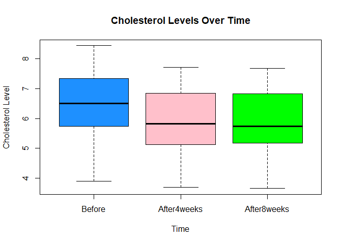
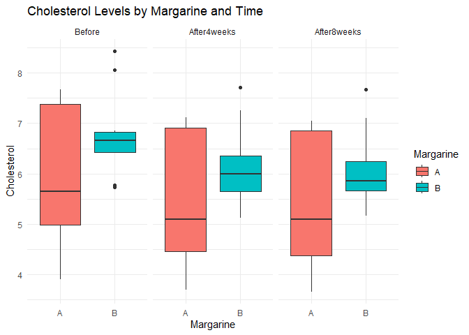
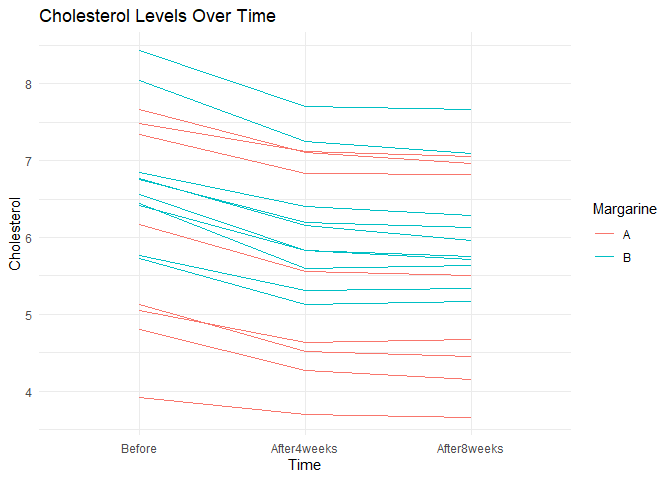

FA10_KHAFAJI_RODILLAS
================
Rodillas
2024-11-26

``` r
library(tidyr)
library(dplyr)
```

``` r
data <- read.csv("E:/Downloads/Cholesterol_R2.csv")

long_data <- data %>%
  pivot_longer(cols = c(Before, After4weeks, After8weeks),
               names_to = "Time",
               values_to = "Cholesterol")

long_data$Time <- factor(long_data$Time, levels = c("Before", "After4weeks", "After8weeks"))
long_data$Margarine <- as.factor(long_data$Margarine)

head(long_data)
```

    ## # A tibble: 6 × 4
    ##      ID Margarine Time        Cholesterol
    ##   <int> <fct>     <fct>             <dbl>
    ## 1     1 B         Before             6.42
    ## 2     1 B         After4weeks        5.83
    ## 3     1 B         After8weeks        5.75
    ## 4     2 B         Before             6.76
    ## 5     2 B         After4weeks        6.2 
    ## 6     2 B         After8weeks        6.13

Assumption 4

``` r
library(ggplot2)
```

``` r
boxplot(Cholesterol ~ Time, data = long_data, main = "Cholesterol Levels Over Time", xlab = "Time", 
        ylab = "Cholesterol Level", col = c("dodgerblue", "pink", "green"), outlier.col = "red")
```

<!-- -->
There are no significant outliers.

Assumption 5

``` r
library(dplyr)
library(e1071)
library(stats)

descriptive_measures <- long_data %>%
  group_by(Margarine, Time) %>%
  summarise(
    Valid = n(),
    Mode = paste(names(sort(table(Cholesterol), decreasing = TRUE)[1]), collapse = ", "), 
    Median = median(Cholesterol),
    Mean = mean(Cholesterol),
    `Std. Deviation` = sd(Cholesterol),
    Variance = var(Cholesterol),
    Skewness = e1071::skewness(Cholesterol),
    `Std. Error of Skewness` = sqrt((6 * Valid * (Valid - 1)) / ((Valid - 2) * (Valid + 1) * (Valid + 3))),
    Kurtosis = e1071::kurtosis(Cholesterol),
    `Std. Error of Kurtosis` = sqrt(24 / Valid),
    Minimum = min(Cholesterol),
    Maximum = max(Cholesterol),
    `25th Percentile` = quantile(Cholesterol, 0.25),
    `50th Percentile` = quantile(Cholesterol, 0.50),
    `90th Percentile` = quantile(Cholesterol, 0.90)
  )
```


``` r
print(descriptive_measures)
```

    ## # A tibble: 6 × 17
    ## # Groups:   Margarine [2]
    ##   Margarine Time     Valid Mode  Median  Mean `Std. Deviation` Variance Skewness
    ##   <fct>     <fct>    <int> <chr>  <dbl> <dbl>            <dbl>    <dbl>    <dbl>
    ## 1 A         Before       8 3.91    5.65  5.94            1.43     2.04    0.0155
    ## 2 A         After4w…     8 3.7     5.10  5.47            1.39     1.93    0.131 
    ## 3 A         After8w…     8 3.66    5.09  5.41            1.37     1.89    0.113 
    ## 4 B         Before      10 5.73    6.66  6.78            0.866    0.751   0.661 
    ## 5 B         After4w…    10 5.83    5.99  6.14            0.815    0.664   0.634 
    ## 6 B         After8w…    10 5.17    5.86  6.08            0.779    0.607   0.809 
    ## # ℹ 8 more variables: `Std. Error of Skewness` <dbl>, Kurtosis <dbl>,
    ## #   `Std. Error of Kurtosis` <dbl>, Minimum <dbl>, Maximum <dbl>,
    ## #   `25th Percentile` <dbl>, `50th Percentile` <dbl>, `90th Percentile` <dbl>

``` r
normality_results <- long_data %>%
  group_by(Margarine, Time) %>%
  summarize(p_value = shapiro.test(Cholesterol)$p.value)
```


``` r
print(normality_results)
```

    ## # A tibble: 6 × 3
    ## # Groups:   Margarine [2]
    ##   Margarine Time        p_value
    ##   <fct>     <fct>         <dbl>
    ## 1 A         Before        0.292
    ## 2 A         After4weeks   0.154
    ## 3 A         After8weeks   0.174
    ## 4 B         Before        0.134
    ## 5 B         After4weeks   0.400
    ## 6 B         After8weeks   0.216

Assumption 6

``` r
library(car)
```


``` r
levene_test_check <- leveneTest(Cholesterol ~ Margarine, data = long_data)
print(levene_test_check)
```

    ## Levene's Test for Homogeneity of Variance (center = median)
    ##       Df F value   Pr(>F)   
    ## group  1  10.505 0.002079 **
    ##       52                    
    ## ---
    ## Signif. codes:  0 '***' 0.001 '**' 0.01 '*' 0.05 '.' 0.1 ' ' 1

Since the p-value (\<0.05), there was no homogeneity of variances of the
dependent variable for all physical activity groups, as assessed by
Levene’s test of homogeneity of variances, p = 0.00208.

``` r
ggplot(long_data, aes(x = Margarine, y = Cholesterol, fill = Margarine)) + geom_boxplot() + facet_wrap(~ Time) + theme_minimal() + 
  labs(title = "Cholesterol Levels by Margarine and Time", y = "Cholesterol")
```

<!-- -->

Because the assumption of a parametric test has been violated due to
unequal variances, we tried non-parametric approaches such as Friedman’s
Test for Within-Subjects Factors to test whether there are significant
differences between the given time conditions, with this case, before,
and after 4 and 8 weeks.

``` r
friedman_test_result <- friedman.test(Cholesterol ~ Time | ID, data = long_data)
print(friedman_test_result)
```

    ## 
    ##  Friedman rank sum test
    ## 
    ## data:  Cholesterol and Time and ID
    ## Friedman chi-squared = 29.778, df = 2, p-value = 3.419e-07

``` r
ggplot(long_data, aes(x = Time, y = Cholesterol, group = ID, color = Margarine)) +geom_line() + theme_minimal() + 
  labs(title = "Cholesterol Levels Over Time", y = "Cholesterol")
```

<!-- -->

``` r
mann_whitney_test_b4 <- wilcox.test(Cholesterol ~ Margarine, data = long_data %>% filter(Time == "Before"))
print(mann_whitney_test_b4)
```

    ## 
    ##  Wilcoxon rank sum exact test
    ## 
    ## data:  Cholesterol by Margarine
    ## W = 26, p-value = 0.237
    ## alternative hypothesis: true location shift is not equal to 0

``` r
mann_whitney_after4weeks <- wilcox.test(Cholesterol ~ Margarine, data = long_data %>% filter(Time == "After4weeks"))
```

``` r
print("Mann-Whitney U test for 'After4weeks':")
```

    ## [1] "Mann-Whitney U test for 'After4weeks':"

``` r
print(mann_whitney_after4weeks)
```

    ## 
    ##  Wilcoxon rank sum test with continuity correction
    ## 
    ## data:  Cholesterol by Margarine
    ## W = 26, p-value = 0.2301
    ## alternative hypothesis: true location shift is not equal to 0

``` r
mann_whitney_after8weeks <- wilcox.test(Cholesterol ~ Margarine, data = long_data %>% filter(Time == "After8weeks"))
print("Mann-Whitney U test for 'After8weeks':")
```

    ## [1] "Mann-Whitney U test for 'After8weeks':"

``` r
print(mann_whitney_after8weeks)
```

    ## 
    ##  Wilcoxon rank sum exact test
    ## 
    ## data:  Cholesterol by Margarine
    ## W = 26, p-value = 0.237
    ## alternative hypothesis: true location shift is not equal to 0

``` r
pairwise.wilcox.test(long_data$Cholesterol, long_data$Time, paired = TRUE, p.adjust.method = "bonferroni")
```


    ##  Pairwise comparisons using Wilcoxon signed rank test with continuity correction 
    ## 
    ## data:  long_data$Cholesterol and long_data$Time 
    ## 
    ##             Before  After4weeks
    ## After4weeks 0.00064 -          
    ## After8weeks 2.3e-05 0.01117    
    ## 
    ## P value adjustment method: bonferroni
