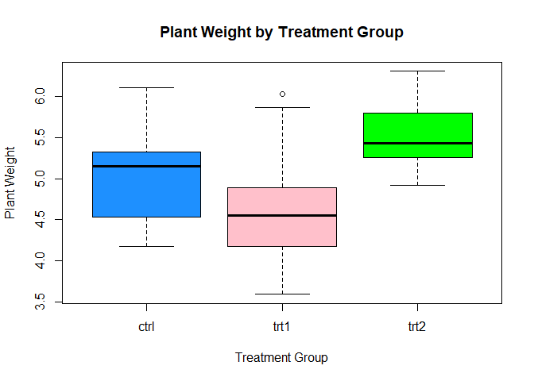
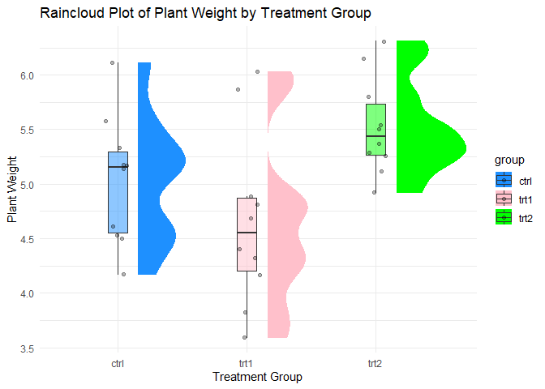

FA 8
================
Rodillas
2024-11-07

``` r
data("PlantGrowth", package = "datasets")

head(PlantGrowth)
```

    ##   weight group
    ## 1   4.17  ctrl
    ## 2   5.58  ctrl
    ## 3   5.18  ctrl
    ## 4   6.11  ctrl
    ## 5   4.50  ctrl
    ## 6   4.61  ctrl

``` r
aggregate_results <- aggregate(weight ~ group, data = PlantGrowth, FUN = function(x) c(mean = mean(x), sd = sd(x), median = median(x)))
aggregate_results <- do.call(data.frame, aggregate_results)

colnames(aggregate_results) <- c("group", "mean", "sd", "median")
print(aggregate_results)
```

    ##   group  mean        sd median
    ## 1  ctrl 5.032 0.5830914  5.155
    ## 2  trt1 4.661 0.7936757  4.550
    ## 3  trt2 5.526 0.4425733  5.435

``` r
boxplot(weight ~ group, data = PlantGrowth, main = "Plant Weight by Treatment Group",xlab = "Treatment Group", ylab = "Plant Weight", col = c("dodgerblue", "pink", "green"))
```

<!-- -->

``` r
library(ggplot2)
```

    ## Warning: package 'ggplot2' was built under R version 4.3.3

``` r
library(ggdist)
```

    ## Warning: package 'ggdist' was built under R version 4.3.3

``` r
ggplot(PlantGrowth, aes(x = group, y = weight, fill = group)) +
  ggdist::stat_halfeye(
    adjust = .5, 
    width = .6, 
    justification = -.3, 
    .width = 0, 
    point_colour = NA
  ) +
  geom_boxplot(
    width = .15, 
    outlier.shape = NA,
    alpha = 0.5
  ) +
  geom_jitter(
    width = .1, 
    alpha = 0.3
  ) +
  scale_fill_manual(values = c("dodgerblue", "pink", "green")) +
  labs(
    title = "Raincloud Plot of Plant Weight by Treatment Group",
    x = "Treatment Group",
    y = "Plant Weight"
  ) +
  theme_minimal()
```

<!-- -->

``` r
library(dplyr)
```

    ## 
    ## Attaching package: 'dplyr'

    ## The following objects are masked from 'package:stats':
    ## 
    ##     filter, lag

    ## The following objects are masked from 'package:base':
    ## 
    ##     intersect, setdiff, setequal, union

``` r
library(e1071)
library(stats)


descriptive_measures <- PlantGrowth %>%
  group_by(group) %>%
  summarise(
    Valid = n(),
    Mode = paste(names(sort(table(weight), decreasing = TRUE)[1]), collapse = ", "), 
    Median = median(weight),
    Mean = mean(weight),
    `Std. Deviation` = sd(weight),
    Variance = var(weight),
    Skewness = e1071::skewness(weight),
    `Std. Error of Skewness` = sqrt((6 * Valid * (Valid - 1)) / ((Valid - 2) * (Valid + 1) * (Valid + 3))),
    Kurtosis = e1071::kurtosis(weight),
    `Std. Error of Kurtosis` = sqrt(24 / Valid),
    Minimum = min(weight),
    Maximum = max(weight),
    `25th Percentile` = quantile(weight, 0.25),
    `50th Percentile` = quantile(weight, 0.50),
    `90th Percentile` = quantile(weight, 0.90)
  )
print(descriptive_measures)
```

    ## # A tibble: 3 × 16
    ##   group Valid Mode  Median  Mean `Std. Deviation` Variance Skewness
    ##   <fct> <int> <chr>  <dbl> <dbl>            <dbl>    <dbl>    <dbl>
    ## 1 ctrl     10 4.17    5.15  5.03            0.583    0.340    0.231
    ## 2 trt1     10 3.59    4.55  4.66            0.794    0.630    0.474
    ## 3 trt2     10 4.92    5.44  5.53            0.443    0.196    0.485
    ## # ℹ 8 more variables: `Std. Error of Skewness` <dbl>, Kurtosis <dbl>,
    ## #   `Std. Error of Kurtosis` <dbl>, Minimum <dbl>, Maximum <dbl>,
    ## #   `25th Percentile` <dbl>, `50th Percentile` <dbl>, `90th Percentile` <dbl>

``` r
normality_results <- PlantGrowth %>%
  group_by(group) %>%
  summarise(
    Shapiro_Wilk_p = shapiro.test(weight)$p.value
  )
print(normality_results)
```

    ## # A tibble: 3 × 2
    ##   group Shapiro_Wilk_p
    ##   <fct>          <dbl>
    ## 1 ctrl           0.747
    ## 2 trt1           0.452
    ## 3 trt2           0.564

``` r
library(car)
```

    ## Warning: package 'car' was built under R version 4.3.3

    ## Loading required package: carData

    ## Warning: package 'carData' was built under R version 4.3.3

    ## 
    ## Attaching package: 'car'

    ## The following object is masked from 'package:dplyr':
    ## 
    ##     recode

``` r
levene_result <- leveneTest(weight ~ group, data = PlantGrowth)

print(levene_result)
```

    ## Levene's Test for Homogeneity of Variance (center = median)
    ##       Df F value Pr(>F)
    ## group  2  1.1192 0.3412
    ##       27

``` r
anova_result <- aov(weight ~ group, data = PlantGrowth)
summary(anova_result)
```

    ##             Df Sum Sq Mean Sq F value Pr(>F)  
    ## group        2  3.766  1.8832   4.846 0.0159 *
    ## Residuals   27 10.492  0.3886                 
    ## ---
    ## Signif. codes:  0 '***' 0.001 '**' 0.01 '*' 0.05 '.' 0.1 ' ' 1

``` r
tukey_result <- TukeyHSD(anova_result)
print(tukey_result)
```

    ##   Tukey multiple comparisons of means
    ##     95% family-wise confidence level
    ## 
    ## Fit: aov(formula = weight ~ group, data = PlantGrowth)
    ## 
    ## $group
    ##             diff        lwr       upr     p adj
    ## trt1-ctrl -0.371 -1.0622161 0.3202161 0.3908711
    ## trt2-ctrl  0.494 -0.1972161 1.1852161 0.1979960
    ## trt2-trt1  0.865  0.1737839 1.5562161 0.0120064
